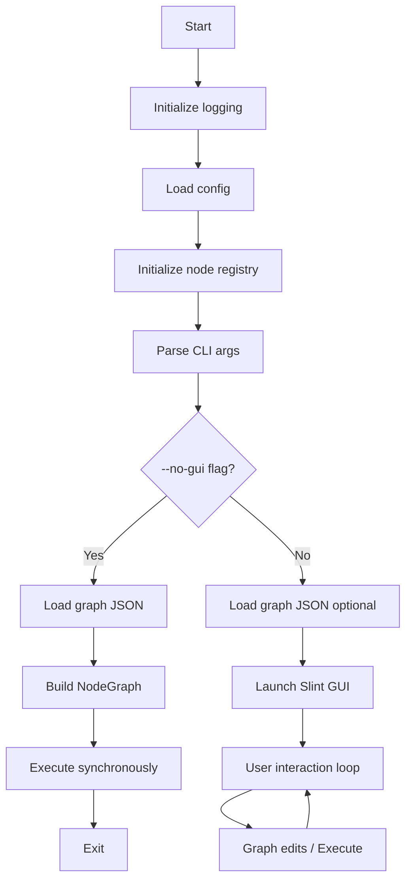
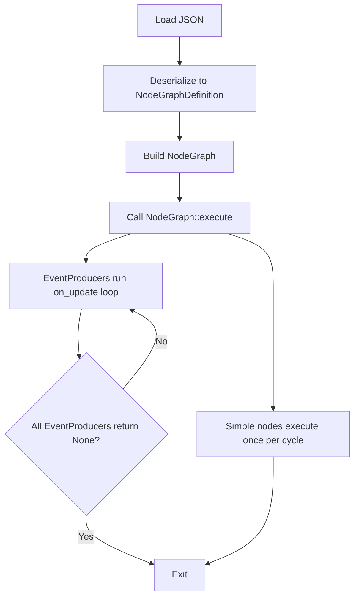
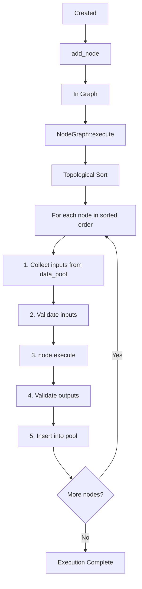
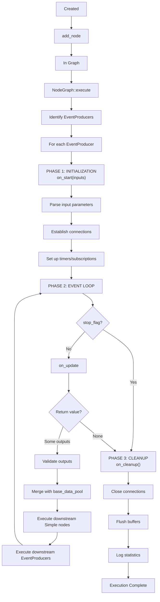
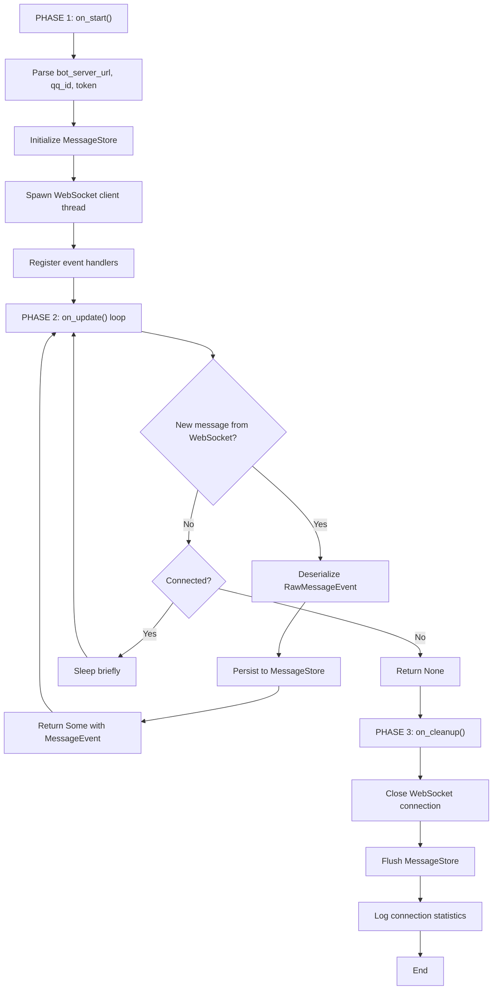
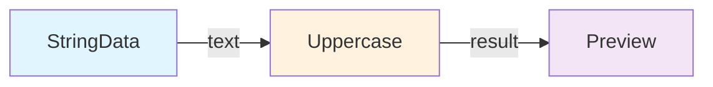
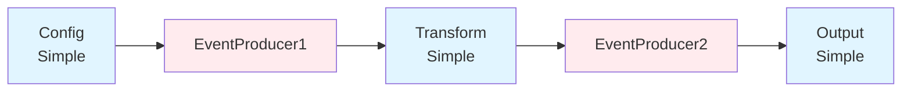
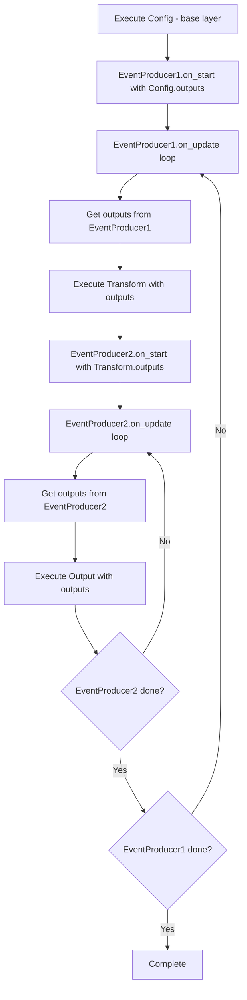

# Architecture & Execution Flow

> **Target audience:** Developers seeking to understand the system's internal design, component interactions, and execution lifecycle.

This document provides a comprehensive overview of the zihuan-next node graph system architecture, covering component design, program flow, node lifecycle, and execution ordering.

---

## Table of Contents

- [System Overview](#system-overview)
- [Project Structure](#project-structure)
- [Component Architecture](#component-architecture)
- [Program Flow](#program-flow)
- [Node Lifecycle](#node-lifecycle)
- [Execution Order & Scheduling](#execution-order--scheduling)
- [Data Flow Model](#data-flow-model)
- [Threading & Concurrency](#threading--concurrency)

---

## System Overview

zihuan-next is a **hybrid visual programming system + bot automation framework** built on a node graph execution engine. It combines:

- **Visual Node Editor** (Slint GUI) for drag-and-drop workflow creation
- **DAG Execution Engine** (Rust) for deterministic node scheduling
- **Event-Driven Architecture** for handling bot messages and timers
- **Three-Tier Storage** (Redis cache -> MySQL -> In-memory) for state persistence

### Key Design Principles

1. **Everything is a Node** — Uniform interface (`Node` trait) for all components
2. **Type-Safe Dataflow** — Strongly typed ports prevent invalid connections
3. **Explicit Dependencies** — Execution order derived from port connections
4. **Fail-Fast Validation** — Cycle detection, type checking, and binding validation at graph build time
5. **Graceful Degradation** — Fallback storage layers ensure reliability

---

## Component Architecture

### Layer Architecture

| Layer | Components | Purpose |
|-------|------------|---------|
| **UI Layer** | Node Graph View<br/>Selection State<br/>Window State | Slint-based GUI for drag-and-drop node editing and visualization |
| **Input/Output** | JSON Serialization | Load/save graph definitions, exchange between UI and engine |
| **Node Graph Engine** | NodeGraph<br/>Validation<br/>Topological Sort<br/>Execution | DAG validation, dependency resolution, execution scheduling |
| **Node Registry** | Factory Pattern<br/>Node Type Metadata | Dynamic node instantiation (Utility, LLM, Bot, Database node types) |
| **Bot Adapter** | WebSocket Client<br/>Event Dispatcher<br/>Message Converter | Handle QQ bot server connections and event routing |
| **Storage** | Redis Cache (L1)<br/>MySQL Persistence (L2)<br/>In-Memory Fallback (L3) | Three-tier message storage with auto-reconnection |
| **External Services** | QQ Bot Server (WebSocket)<br/>LLM API (HTTP) | Remote systems providing bot events and AI capabilities |

### Core Components

#### 1. Node Graph Engine

**Purpose:** The execution runtime that validates, schedules, and executes node graphs.

**Key Types:**
- `Node` trait — Defines execution interface (`execute()`, lifecycle hooks)
- `NodeGraph` — Container for nodes, manages dependencies and execution order
- `Port` — Typed input/output channels (with `DataType` and `required` flag)
- `DataValue` — Runtime value wrapper (String, Integer, Json, etc.)

**Responsibilities:**
- **Validation:** Check for cycles, type mismatches, unbound required ports
- **Scheduling:** Topological sort based on port dependencies
- **Execution:** Run nodes in order, pass data via output -> input port binding
- **Lifecycle Management:** Handle EventProducer `on_start()` -> `on_update()` loop -> `on_cleanup()`

#### 2. Bot Adapter Layer

**Purpose:** Bridge between external bot servers and the node graph system.

**Components:**
- `BotAdapter` — WebSocket client that maintains persistent connection to QQ bot server
- `EventHandler` — Callback functions registered to process specific event types
- `MessageEvent` / `MessageType` — Typed representations of bot events (text, image, at-mention)

**Data Flow:**
```
QQ Server -> WebSocket -> BotAdapter -> RawMessageEvent -> Deserialize -> MessageEvent
    -> EventProducer Node (BotAdapterNode) -> output port "message_event" -> Downstream Nodes
```

#### 3. LLM Integration Layer

**Purpose:** Wrap LLM APIs as nodes, provide tool-calling orchestration.

**Components:**
- `LLMNode` — Simple text -> response node (HTTP POST to chat endpoint)
- `AgentNode` — Multi-turn agent with function calling (loops until tools exhausted)
- `BrainAgent` — Advanced orchestrator with context retrieval and code execution tools
- `FunctionTool` trait — Pluggable tool interface (JSON schema + execute method)

**Tool Execution Flow:**
```
AgentNode.execute(prompt) -> LLM API call -> Response with tool_calls
    -> Execute each tool via FunctionTool::execute() -> Collect results
    -> Append tool results to messages -> Loop back to LLM -> Final response
```

#### 4. Storage Layer

**Purpose:** Provide resilient message persistence with multiple backends.

**Three-Tier Architecture:**
1. **Redis (L1)** — Fast cache for recent messages (TTL-based eviction)
2. **MySQL (L2)** — Long-term persistence with queryable history
3. **In-Memory (L3)** — Fallback HashMap when Redis/MySQL unavailable

**Auto-Reconnection:** Background threads retry connections on failure (exponential backoff).

---

## Program Flow

### Startup Sequence




### Headless Mode Flow (CLI)

```bash
cargo run -- --graph-json my_graph.json --no-gui
```



---

## Node Lifecycle

### Simple Node Lifecycle



### EventProducer Lifecycle

EventProducers have a stateful lifecycle with three phases:



### Example: BotAdapterNode Lifecycle



---

## Execution Order & Scheduling

### Dependency Resolution (Port-Based)

Execution order is derived from port bindings:



**Port Connections:**
- `StringData.output("text")` → `Uppercase.input("text")`
- `Uppercase.output("result")` → `Preview.input("text")`

**Topological Sort:** `[StringData, Uppercase, Preview]`

### Kahn's Algorithm (Simplified)

```rust
fn topological_sort(graph: &NodeGraph) -> Result<Vec<String>> {
    let mut in_degree: HashMap<String, usize> = ...;  // Count incoming edges
    let mut ready: Vec<String> = nodes with in_degree == 0;
    let mut sorted = vec![];

    while !ready.is_empty() {
        let node_id = ready.remove(0);  // Pick node with no dependencies
        sorted.push(node_id.clone());

        for dependent in dependents_of(node_id) {
            in_degree[dependent] -= 1;
            if in_degree[dependent] == 0 {
                ready.push(dependent);
            }
        }
    }

    if sorted.len() != nodes.len() {
        return Err("Cycle detected");  // Not a DAG
    }
    Ok(sorted)
}
```

### Mixed Simple + EventProducer Execution

When both node types coexist:

1. **Identify reachable subgraphs:** DFS from each EventProducer to find downstream nodes
2. **Execute base layer:** Run all Simple nodes **not** reachable from any EventProducer
3. **Run EventProducer roots:** For each root EventProducer (no upstream EventProducers):
   - `on_start()` with base layer outputs as inputs
   - Loop `on_update()`:
     - Merge outputs with base layer → `event_pool`
     - Execute all reachable Simple nodes in order
     - Execute nested EventProducers (if any)

**Example Graph:**



**Execution Flow:**



---

## Data Flow Model

### Port-Based Binding

Data flows from **output ports** -> **input ports** with matching names (or via explicit edges):

```rust
// Legacy mode (empty edges array): Auto-binding by name
Output port "result" -> Input port "result"

// Explicit mode (edges defined):
edges: [
  { from_node_id: "n1", from_port: "out", to_node_id: "n2", to_port: "in" }
]
```

### Data Pool (Execution Context)

During execution, a `HashMap<String, DataValue>` accumulates outputs:

```rust
let mut data_pool = HashMap::new();

for node_id in sorted_order {
    let inputs = collect_inputs(node, &data_pool);  // Pull from pool
    let outputs = node.execute(inputs);
    
    for (port_name, value) in outputs {
        data_pool.insert(port_name, value);  // Push to pool
    }
}
```

### Type Safety

- **Compile-time:** `DataType` enum ensures only valid types are declared
- **Runtime:** `validate_inputs()` / `validate_outputs()` enforce type matching:
  ```rust
  if value.data_type() != port.data_type {
      return Err("Type mismatch: expected String, got Integer");
  }
  ```

---

## Threading & Concurrency

### Main Thread (UI Mode)

- **Slint Event Loop:** Handles UI events (clicks, drags, keyboard)
- **Synchronous Execution:** Simple-only graphs block the main thread
- **Async Execution:** EventProducer graphs spawn background thread:
  ```rust
  std::thread::spawn(move || {
      node_graph.execute();
      slint::invoke_from_event_loop(|| { /* Update UI */ });
  });
  ```

### Background Threads (Headless Mode)

- **Tokio Runtime:** All async I/O (WebSocket, HTTP, Redis, MySQL) runs on Tokio executor
- **EventProducer Loop:** Each `on_update()` may spawn tasks:
  ```rust
  let msg = tokio::task::block_in_place(|| {
      rx.blocking_recv()  // Wait for WebSocket message
  });
  ```

### Shared State (BotAdapter)

- **Arc<TokioMutex<BotAdapter>>:** Allows multiple async tasks to access bot state
- **Message Channels:** WebSocket thread -> Main execution thread via `mpsc::unbounded_channel()`

---

## See Also

- **[Node Graph JSON Specification](./node-graph-json.md)** — JSON format for persisting graphs
- **[Node Development Guide](./node-development.md)** — How to create custom nodes
