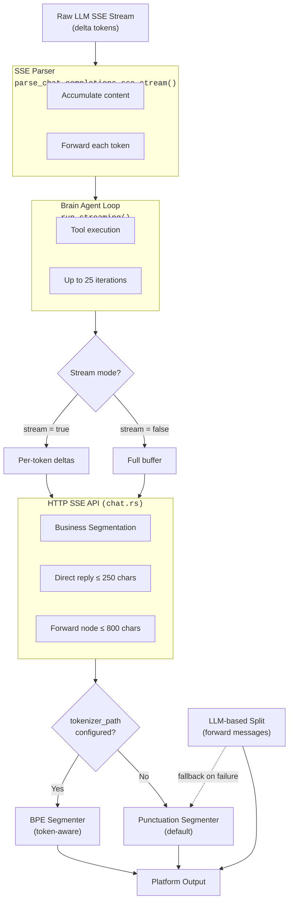

# LLM Response Segmentation

When the agent generates a reply through a Large Language Model (LLM), the raw text is often too long or structurally unsuitable for the target platform. Zihuan-Next provides a multi-layer segmentation system that breaks LLM output into appropriately sized pieces before delivery.

## Overview

Segmentation operates at three layers:

1. **Token streaming** — individual tokens are forwarded to the HTTP client in real time.
2. **Business-logic segmentation** — text is split into platform-compatible chunks (e.g., QQ message limits).
3. **HTTP stream formatting** — for compatibility endpoints that simulate streaming from a non-streaming response.



## Streaming Modes

### Token-Level Streaming (stream = true, default)

Each token delta is sent to the client as an individual SSE event:

```
data: {"type":"delta","token":"Hello"}
data: {"type":"delta","token":" world"}
data: {"type":"delta","token":"!"}
```

This provides real-time feedback with no buffering at the HTTP layer.

### Non-Streaming (stream = false)

All tokens are collected into a complete response before sending a single delta event:

```
data: {"type":"delta","token":"Hello world!"}
```

## Business Segmentation

After the LLM finishes generating, the full text may need to be split for platform constraints.

### Direct Text Replies

- **Maximum length:** 250 characters per segment (`MAX_REPLY_CHARS`)
- **Strategy:** punctuation-based semantic splitting
- **Use case:** short replies sent directly as text messages

When a reply fits within 250 characters, it is delivered as a single message. Longer replies are split at semantic boundaries (see [Segmentation Strategies](#segmentation-strategies) below).

### Forward Messages

- **Maximum length:** 800 characters per node (`MAX_FORWARD_NODE_CHARS`)
- **Strategy:** LLM-based splitting (preferred) or punctuation-based fallback
- **Use case:** long-form content displayed as QQ forward message nodes

Forward messages are QQ's way of displaying multi-part content in a compact, expandable format. Each node in the forward message corresponds to one segment.

## Segmentation Strategies

### 1. Punctuation Segmenter (Default)

Splits text at punctuation marks, prioritizing natural sentence boundaries.

**Algorithm:**

1. Walk the text from left to right in windows of `max_chars`.
2. Inside each window, search backward from the end for a **strong separator** (`\n`, `。`, `！`, `？`, `；`, `：`, `.`, `!`, `?`, `;`, `:`).
3. If no strong separator is found in the rightmost third of the window, search for a **weak separator** (`，`, `,`, space, tab).
4. If no separator is found at all, perform a hard character split at `max_chars`.

**Example:**

```
Input:  "今天天气很好，适合出门。明天可能会下雨，记得带伞。后天就放晴了。"
Max:    20 chars

Output: ["今天天气很好，适合出门。", "明天可能会下雨，记得带伞。", "后天就放晴了。"]
```

**Characteristics:**

- No external dependencies; works out of the box.
- Handles Chinese and English punctuation.
- Empty or whitespace-only segments are automatically filtered.
- Preserves the separators at the end of each segment.

### 2. BPE Tokenizer Segmenter (Token-Aware)

When a tokenizer file is provided via `tokenizer_path`, the system splits text at actual token boundaries. This avoids breaking multi-byte characters or mid-word positions.

**Algorithm:**

1. Encode the full text with the BPE tokenizer.
2. Map token byte offsets back to character positions.
3. Search for a token boundary within the rightmost third of each `max_chars` window (from ⅔ position to `max_chars`).
4. Split at that boundary.
5. If the tokenizer fails to load or encode, transparently falls back to the punctuation segmenter.

**Configuration:**

Set `tokenizer_path` in the system config to the path of a HuggingFace `tokenizer.json` file. If the path is invalid or the file cannot be loaded, the system logs a warning and uses the punctuation segmenter instead.

**Example:**

```
Tokenizer: cl100k_base (GPT-4 / text-embedding-ada-002)
Input:     "Large language models process text in tokens, not characters."
Max:       40 chars

Output:    ["Large language models process text", " in tokens, not characters."]
```

### 3. LLM-Based Splitting (Forward Messages Only)

For forward messages, zihuan-next can ask the LLM itself to split the text into natural semantic segments.

**How it works:**

1. The full generated text is sent back to the LLM with a system_prompt asking it to return a JSON array of strings.
2. The LLM preserves the original content — no summarization, no rewriting.
3. Each array element must stay within `MAX_FORWARD_NODE_CHARS` (800 chars).
4. The response is parsed as JSON; empty chunks are filtered.

**Fallback:** If the LLM call fails, returns tool calls, or produces unparseable JSON, the system falls back to punctuation-based splitting and logs a warning.

**When to use:** Enable this when the agent frequently generates long, structured content (reports, analyses, lists) and you want the most natural segmentation possible.

### 4. Fixed-Size Stream Chunks

For the HTTP stream compatibility endpoint (which exposes a non-streaming agent as an OpenAI-compatible streaming API), the final response is split into fixed-sized chunks.

- **Chunk size:** 64 characters
- **Use case:** simulating progressive token delivery for clients that expect streaming behavior

## Configuration Summary

| Parameter | Default | Description |
|---|---|---|
| `stream` | `true` | Enable per-token streaming to HTTP clients |
| `tokenizer_path` | *(none)* | Path to `tokenizer.json` — enables BPE segmenter |
| LLM split for forwards | enabled | Uses LLM to split forward messages; falls back to punctuation |

**Hardcoded limits (not user-configurable):**

| Constant | Value | Purpose |
|---|---|---|
| `MAX_REPLY_CHARS` | 250 | Maximum characters per direct text reply segment |
| `MAX_FORWARD_NODE_CHARS` | 800 | Maximum characters per forward message node |
| Stream chunk size | 64 | Characters per SSE chunk in compatibility endpoint |

## Edge Cases

| Situation | Behavior |
|---|---|
| Single semantic unit exceeds `max_chars` | Hard character split is applied as a last resort |
| BPE tokenizer fails to load | Falls back to punctuation segmenter with a warning log |
| LLM-based split returns invalid JSON | Falls back to punctuation split with a warning log |
| Text is empty or whitespace only | Returns an empty segment list |
| Code fences (` ``` `) in forward messages | Opening/closing markers are balanced across nodes |
| `\r\n` in SSE stream | Carriage returns are stripped during parsing |
| Tool call arguments in stream | Accumulated via `StreamToolCallDelta`, finalized once stream ends |
