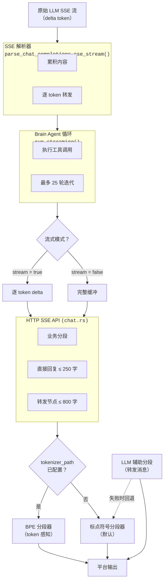

# 大模型返回结果分段

当 Agent 通过大语言模型（LLM）生成回复时，原始文本通常过长或结构上不适合目标平台直接展示。Zihuan-Next 提供了多层分段系统，在内容投递前将 LLM 输出拆分为合适大小的片段。

## 概述

分段在三个层次上运行：

1. **Token 流式传输** — 逐个 token 实时转发至 HTTP 客户端。
2. **业务逻辑分段** — 将文本按平台限制拆分为合规片段（如 QQ 消息长度限制）。
3. **HTTP 流格式化** — 为兼容端点将非流式响应模拟为流式输出。



## 流式传输模式

### 逐 Token 流式传输（stream = true，默认）

每个 token 增量作为独立的 SSE 事件发送给客户端：

```
data: {"type":"delta","token":"你好"}
data: {"type":"delta","token":"世界"}
data: {"type":"delta","token":"！"}
```

实时反馈，HTTP 层无缓冲。

### 非流式传输（stream = false）

所有 token 收集为完整响应后，一次性发送单个 delta 事件：

```
data: {"type":"delta","token":"你好世界！"}
```

## 业务分段

LLM 生成完成后，完整文本可能需要按平台约束进行分段。

### 直接文本回复

- **最大长度：** 每段 250 字（`MAX_REPLY_CHARS`）
- **策略：** 基于标点符号的语义分割
- **使用场景：** 作为文本消息直接发送的短回复

当回复不超过 250 字时，以单条消息发送；超过则在语义边界处分段（见下方[分段策略](#分段策略)）。

### 转发消息

- **最大长度：** 每节点 800 字（`MAX_FORWARD_NODE_CHARS`）
- **策略：** LLM 分段（优先）或标点符号分段（回退）
- **使用场景：** 长文本以 QQ 转发消息节点的形式展示

转发消息是 QQ 中以紧凑、可展开格式展示多段内容的方式，每个节点对应一个分段。

## 分段策略

### 1. 标点符号分段器（默认）

在标点符号处拆分文本，优先保持自然句子边界。

**算法：**

1. 从左到右以 `max_chars` 为窗口宽度遍历文本。
2. 在每个窗口内，从末尾向前搜索**强分隔符**（`\n`、`。`、`！`、`？`、`；`、`：`、`.`、`!`、`?`、`;`、`:`）。
3. 若在窗口右侧三分之一区域内未找到强分隔符，则搜索**弱分隔符**（`，`、`,`、空格、制表符）。
4. 若均未找到，则在 `max_chars` 处硬截断。

**示例：**

```
输入：  "今天天气很好，适合出门。明天可能会下雨，记得带伞。后天就放晴了。"
上限：  20 字

输出：  ["今天天气很好，适合出门。", "明天可能会下雨，记得带伞。", "后天就放晴了。"]
```

**特点：**

- 无外部依赖，开箱即用。
- 同时处理中文和英文标点。
- 空白或纯空格段落自动过滤。
- 分隔符保留在各段末尾。

### 2. BPE Tokenizer 分段器（Token 感知）

当通过 `tokenizer_path` 提供 tokenizer 文件时，系统在实际的 token 边界处拆分文本，避免截断多字节字符或单词中间位置。

**算法：**

1. 使用 BPE tokenizer 对全文编码。
2. 将 token 的字节偏移映射回字符位置。
3. 在每个 `max_chars` 窗口的右侧三分之一区域（从 ⅔ 位置到 `max_chars`）内搜索 token 边界。
4. 在该边界处拆分。
5. 若 tokenizer 加载或编码失败，透明回退至标点符号分段器。

**配置：**

在系统配置中设置 `tokenizer_path` 为 HuggingFace `tokenizer.json` 文件的路径。若路径无效或文件无法加载，系统记录警告并使用标点符号分段器。

**示例：**

```
Tokenizer：cl100k_base（GPT-4 / text-embedding-ada-002）
输入：     "Large language models process text in tokens, not characters."
上限：     40 字

输出：     ["Large language models process text", " in tokens, not characters."]
```

### 3. LLM 辅助分段（仅转发消息）

对于转发消息，Zihuan-Next 可以让 LLM 本身将文本拆分为自然的语义片段。

**工作方式：**

1. 将完整生成文本连同系统提示一同发送给 LLM，要求返回 JSON 字符串数组。
2. LLM 保留原始内容——不总结、不重写。
3. 每个数组元素不超过 `MAX_FORWARD_NODE_CHARS`（800 字）。
4. 响应作为 JSON 解析；空片段被过滤。

**回退机制：** 若 LLM 调用失败、返回工具调用或产出无法解析的 JSON，系统回退至标点符号分段，并记录警告日志。

**适用场景：** 当 Agent 频繁生成结构化长内容（报告、分析、列表）且希望获得最自然的分段结果时启用。

### 4. 固定大小流式分片

用于 HTTP 流式兼容端点（将非流式 Agent 以 OpenAI 兼容的流式 API 形式暴露），最终响应被拆分为固定大小的片段。

- **分片大小：** 64 字符
- **使用场景：** 为期望流式行为的客户端模拟渐进式 token 投递

## 配置一览

| 参数 | 默认值 | 说明 |
|---|---|---|
| `stream` | `true` | 启用逐 token 流式传输至 HTTP 客户端 |
| `tokenizer_path` | *（无）* | `tokenizer.json` 路径——启用 BPE 分段器 |
| 转发消息 LLM 分段 | 启用 | 使用 LLM 拆分转发消息；失败时回退至标点分段 |

**硬编码限制（不可用户配置）：**

| 常量 | 值 | 用途 |
|---|---|---|
| `MAX_REPLY_CHARS` | 250 | 每段直接文本回复的最大字数 |
| `MAX_FORWARD_NODE_CHARS` | 800 | 每个转发消息节点的最大字数 |
| 流式分片大小 | 64 | 兼容端点每个 SSE 分片的字符数 |

## 边界情况

| 情况 | 行为 |
|---|---|
| 单个语义单元超过 `max_chars` | 作为最后手段进行硬字符截断 |
| BPE tokenizer 加载失败 | 回退至标点符号分段器，记录警告 |
| LLM 辅助分段返回无效 JSON | 回退至标点符号分段，记录警告 |
| 文本为空或仅含空白 | 返回空分段列表 |
| 转发消息中含代码围栏（` ``` `） | 开闭标记在节点间保持配对 |
| SSE 流中含 `\r\n` | 解析时去除回车符 |
| 流中含工具调用参数 | 通过 `StreamToolCallDelta` 累积，流结束后终态化 |
