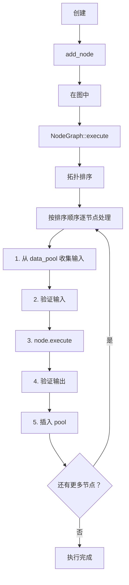
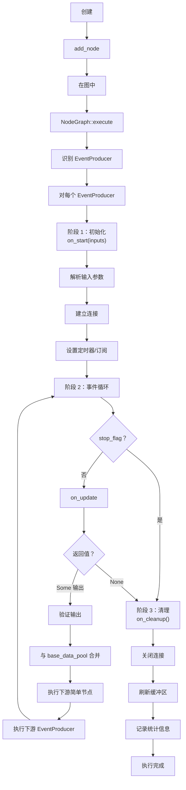
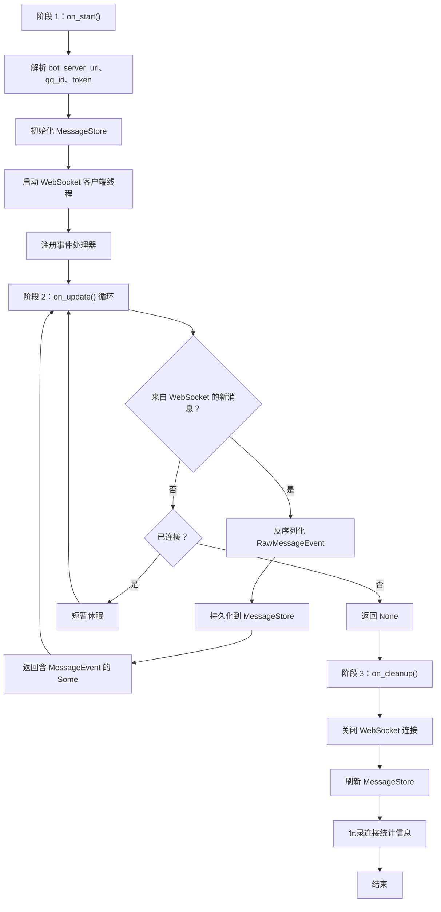
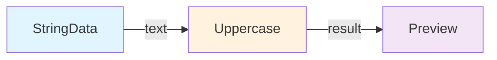
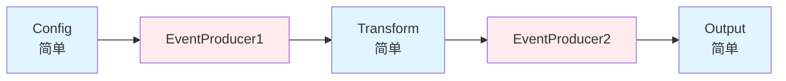
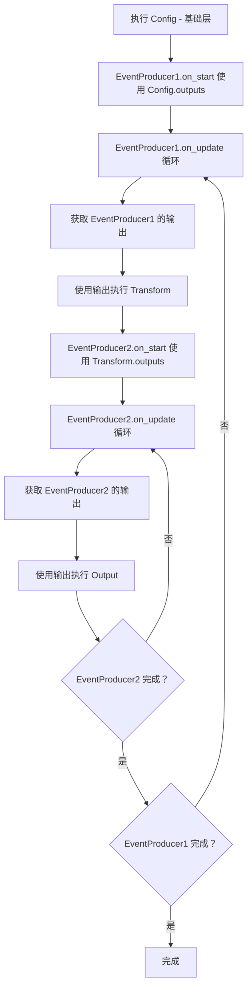

# 节点生命周期与执行流程

> 🌐 [English](node-lifecycle.md) | 简体中文

本文档详细介绍 zihuan-next 系统中节点的内部执行模型，包括生命周期阶段、执行顺序和并发模式。

---

## 目录

- [节点执行模型](#节点执行模型)
- [简单节点生命周期](#简单节点生命周期)
- [EventProducer 节点生命周期](#eventproducer-节点生命周期)
- [执行顺序与调度](#执行顺序与调度)
- [数据流模型](#数据流模型)
- [线程与并发](#线程与并发)

---

## 节点执行模型

系统支持两种根本不同的执行模型：

| 模型 | 使用场景 | 关键方法 | 有状态？ |
|-------|-------------|-------------|-----------|
| **简单节点** | 无状态变换、纯函数 | `execute()` | 否 |
| **EventProducer** | 事件源、定时器、流式数据 | `on_start()`、`on_update()`、`on_cleanup()` | 是 |

### 简单节点

- 每个输入集**执行一次**
- 执行之间无持久状态
- 示例：字符串变换、数学运算、条件逻辑

### EventProducer 节点

- 跨多次执行维护**内部状态**
- 运行**生命周期循环**（启动 → 更新循环 → 清理）
- 示例：WebSocket 客户端、消息队列、定时器、轮询服务

---

## 简单节点生命周期

简单节点遵循直接的执行路径：



### 执行步骤

1. **输入收集**：从 `data_pool`（上游节点的输出）收集值
2. **输入验证**：检查所有必要端口都有值且类型匹配
3. **执行**：以验证后的输入调用节点的 `execute()` 方法
4. **输出验证**：验证输出类型与端口声明匹配
5. **Pool 更新**：将输出插入 `data_pool` 供下游节点使用

### 示例：UppercaseNode

```rust
impl Node for UppercaseNode {
    fn execute(&mut self, inputs: HashMap<String, DataValue>) 
        -> Result<HashMap<String, DataValue>> {
        // 步骤 1：提取输入
        let text = inputs.get("text")?.as_string()?;
        
        // 步骤 2：变换（无状态）
        let result = text.to_uppercase();
        
        // 步骤 3：返回输出
        Ok(HashMap::from([
            ("result".to_string(), DataValue::String(result))
        ]))
    }
}
```

此节点在图执行期间恰好被调用一次。

---

## EventProducer 节点生命周期

EventProducer 具有三阶段生命周期，内含事件循环：



### 阶段 1：初始化（on_start）

**目的：** 设置内部状态并建立连接。

**典型操作：**
- 从输入端口解析配置
- 打开网络连接（WebSocket、HTTP 客户端）
- 初始化定时器或轮询线程
- 分配资源（缓冲区、缓存）

**示例：**
```rust
fn on_start(&mut self, inputs: HashMap<String, DataValue>) -> Result<()> {
    self.url = inputs.get("bot_server_url")?.as_string()?;
    self.ws_client = WebSocketClient::connect(&self.url).await?;
    self.message_store = MessageStore::new(redis_url, mysql_url)?;
    Ok(())
}
```

### 阶段 2：事件循环（on_update）

**目的：** 每次迭代产生事件/数据，直到耗尽。

**返回值：**
- `Some(outputs)` — 有新数据可用，继续循环
- `None` — 没有更多事件，退出循环

**典型操作：**
- 检查新消息/事件
- 轮询外部服务
- 生成定时器滴答
- 通过输出端口返回数据

**示例：**
```rust
fn on_update(&mut self) -> Result<Option<HashMap<String, DataValue>>> {
    // 检查新的 WebSocket 消息
    if let Some(msg) = self.ws_client.try_recv()? {
        let event = deserialize_message(msg)?;
        self.message_store.save(&event)?;
        
        return Ok(Some(HashMap::from([
            ("message_event".to_string(), DataValue::MessageEvent(event))
        ])));
    }
    
    // 无新数据，继续循环
    std::thread::sleep(Duration::from_millis(100));
    Ok(Some(HashMap::new()))  // 返回空值以继续
}
```

**循环终止：**
```rust
// 返回 None 来表示完成
if self.ws_client.is_closed() {
    return Ok(None);  // 触发清理阶段
}
```

### 阶段 3：清理（on_cleanup）

**目的：** 释放资源并执行最终操作。

**典型操作：**
- 关闭网络连接
- 将缓冲区刷新到磁盘/数据库
- 记录统计信息
- 释放已分配内存

**示例：**
```rust
fn on_cleanup(&mut self) -> Result<()> {
    self.ws_client.close()?;
    self.message_store.flush()?;
    info!("BotAdapter 处理了 {} 条消息", self.message_count);
    Ok(())
}
```

### 真实示例：BotAdapterNode



---

## 执行顺序与调度

### 依赖解析（基于端口）

执行顺序自动从端口连接中推导，无需手动排序。



**端口连接：**
- `StringData.output("text")` → `Uppercase.input("text")`
- `Uppercase.output("result")` → `Preview.input("text")`

**最终执行顺序：** `[StringData, Uppercase, Preview]`

### 拓扑排序（Kahn 算法）

引擎使用 Kahn 算法确定执行顺序：

1. 统计每个节点的入边数（入度）
2. 从没有依赖的节点开始（入度 = 0）
3. 执行节点，然后减少其依赖节点的入度
4. 重复直到所有节点处理完毕
5. 如果还有节点未处理，则存在环（错误）

**伪代码：**
```rust
fn topological_sort(graph: &NodeGraph) -> Result<Vec<String>> {
    let mut in_degree: HashMap<String, usize> = ...;  // 统计依赖数
    let mut ready: Vec<String> = nodes_with_no_dependencies();
    let mut sorted = vec![];

    while let Some(node_id) = ready.pop() {
        sorted.push(node_id.clone());

        for dependent in get_dependents(&node_id) {
            in_degree[dependent] -= 1;
            if in_degree[dependent] == 0 {
                ready.push(dependent);
            }
        }
    }

    if sorted.len() != total_nodes {
        return Err("检测到环");
    }
    Ok(sorted)
}
```

### 混合简单节点 + EventProducer 执行

当图中同时存在两种节点类型时：

**策略：**
1. 识别所有 EventProducer 及其可达子图
2. 执行**基础层**（不在任何 EventProducer 下游的简单节点）
3. 对每个**根 EventProducer**（无上游 EventProducer）：
   - 以基础层输出调用 `on_start()`
   - 循环 `on_update()`：
     - 将新输出与基础层数据合并
     - 执行可达的简单节点
     - 执行嵌套的 EventProducer（如果有）

**示例图：**



**执行流程：**



---

## 数据流模型

### 基于端口的绑定

数据通过类型化端口流动。两种绑定模式：

**1. 传统模式（按名称自动绑定）：**
```json
{
  "edges": []
}
```
输出端口 `"result"` 自动连接到任意节点上名为 `"result"` 的输入端口。

**2. 显式模式（定义边）：**
```json
{
  "edges": [
    {
      "from_node_id": "node1",
      "from_port": "output_name",
      "to_node_id": "node2",
      "to_port": "input_name"
    }
  ]
}
```

### 数据池（执行上下文）

执行期间，共享的 `HashMap<String, DataValue>` 累积输出：

```rust
let mut data_pool = HashMap::new();

for node_id in sorted_order {
    // 从 pool 获取输入
    let inputs = collect_inputs(node, &data_pool);
    
    // 执行节点
    let outputs = node.execute(inputs)?;
    
    // 将输出推入 pool
    for (port_name, value) in outputs {
        data_pool.insert(port_name, value);
    }
}
```

**关键属性：**
- 端口名作为全局键
- 后续节点会覆盖同名端口的早期值
- 执行前必须满足必要端口

### 类型安全

**编译时：**
- `DataType` 枚举确保只声明有效类型
- Rust 类型系统防止无效的 `DataValue` 构造

**运行时：**
- 输入验证在 `execute()` 之前检查类型匹配
- 输出验证在 `execute()` 之后检查类型匹配

```rust
// 运行时类型检查
fn validate_inputs(node: &Node, inputs: &HashMap<String, DataValue>) -> Result<()> {
    for port in node.input_ports() {
        if let Some(value) = inputs.get(&port.name) {
            if value.data_type() != port.data_type {
                return Err(format!(
                    "端口 '{}' 类型不匹配：期望 {:?}，实际 {:?}",
                    port.name, port.data_type, value.data_type()
                ));
            }
        } else if port.required {
            return Err(format!("必要端口 '{}' 未绑定", port.name));
        }
    }
    Ok(())
}
```

---

## 线程与并发

### 主线程（UI 模式）

**Slint 事件循环：**
- 处理 UI 事件（鼠标、键盘、渲染）
- 在同步操作上阻塞

**图执行：**
- **仅简单节点图**：执行期间阻塞主线程
- **含 EventProducer 图**：启动后台线程以避免冻结 UI

```rust
// GUI 模式下 EventProducer 的执行
std::thread::spawn(move || {
    node_graph.execute();
    
    // 完成时通知 UI
    slint::invoke_from_event_loop(move || {
        // 更新 UI 状态
    });
});
```

### 后台线程（无界面模式）

**Tokio 异步运行时：**
- 所有异步 I/O（WebSocket、HTTP、Redis、MySQL）在 Tokio 执行器上运行
- EventProducer 可以使用阻塞或异步操作

**EventProducer `on_update()` 模式：**

```rust
// 阻塞模式（在线程池上运行）
fn on_update(&mut self) -> Result<Option<HashMap<String, DataValue>>> {
    let msg = tokio::task::block_in_place(|| {
        self.rx.blocking_recv()  // 等待消息
    });
    // 处理 msg...
}

// 异步模式（需要 async trait，待实现）
async fn on_update_async(&mut self) -> Result<Option<HashMap<String, DataValue>>> {
    let msg = self.rx.recv().await;
    // 处理 msg...
}
```

### 共享状态（线程安全）

**BotAdapter 示例：**
```rust
Arc<TokioMutex<BotAdapter>>  // 允许多个任务访问机器人状态
```

**消息通道：**
```rust
// WebSocket 线程 -> 主执行线程
let (tx, rx) = mpsc::unbounded_channel();

// WebSocket 线程发送消息
tx.send(message)?;

// EventProducer 在 on_update() 中接收
if let Some(msg) = rx.try_recv()? {
    // 处理消息
}
```

### 并发保证

- **简单节点**：从不并发（顺序执行）
- **EventProducer**：可能启动内部线程，但 `on_update()` 顺序调用
- **数据池**：单线程访问（执行期间无需锁）

---

## 性能注意事项

### 图优化建议

1. **最小化 EventProducer**：每个都会增加开销和延迟
2. **批量操作**：优先使用可处理多个条目的节点
3. **避免环**：图验证会拒绝，但会浪费工作
4. **使用适当类型**：避免不必要的序列化（String ↔ Json）

### 性能分析

在日志中查看执行时间：
```
[NodeGraph] Execution started
[UppercaseNode] execute() took 0.12ms
[EventProducer1] on_update() iteration 45 took 15.3ms
[NodeGraph] Total execution: 1.234s
```

---

## 参见

- **[节点图 JSON 规范](./node-graph-json.zh-CN.md)** — 持久化图的 JSON 格式
- **[节点开发指南](./node-development.zh-CN.md)** — 如何创建自定义节点
- **[用户指南](../user-guide.zh-CN.md)** — 运行应用的终端用户指南
- **[程序执行流程](../program-execute-flow.zh-CN.md)** — 内部执行详情
