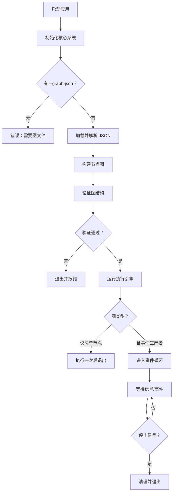

# 程序执行流程

> 🌐 [English](program-execute-flow.md) | 简体中文

本文档概述了 zihuan-next 系统在两种主要模式下的内部执行流程：GUI 模式和无界面模式。

---

## 目录

- [程序执行流程](#程序执行流程)
  - [目录](#目录)
  - [概述](#概述)
  - [GUI 模式执行](#gui-模式执行)
    - [启动流程](#启动流程)
    - [特性](#特性)
  - [无界面模式执行](#无界面模式执行)
    - [启动流程](#启动流程-1)
    - [特性](#特性-1)
  - [执行逻辑对比](#执行逻辑对比)
  - [参见](#参见)

---

## 概述

应用根据命令行参数决定启动哪种模式：

- **无参数**：默认启动 **GUI 模式**。
- **`--no-gui` 参数**：强制启动**无界面模式**。

无论哪种模式，系统启动时始终执行以下初始步骤：
1. **初始化日志**：设置控制台和文件日志（`./logs/`）。
2. **加载配置**：读取 `config.yaml` 和环境变量。
3. **注册节点**：将所有已知节点类型（Bot、LLM、工具节点）动态注册到内部注册表。

---

## GUI 模式执行

在 GUI 模式下，应用启动一个基于 Slint 的窗口系统。执行引擎响应用户操作，或在独立线程中运行以保持 UI 响应。

GUI 子系统分为根窗口契约与专用模块，分别负责画布渲染、节点渲染、共享视图模型结构体和覆盖层对话框。这样在保持运行时行为一致的同时，减少了单个 Slint 文件内的 UI 耦合。

### 启动流程

```mermaid
flowchart TD
    A[启动应用] --> B[初始化核心系统]
    B --> C[创建 NodeGraphWindow]
    C --> C1[加载共享 UI 视图模型]
    C1 --> C2[组合 GraphCanvas、NodeItem 视图、对话框]
    C2 --> D[用户交互循环]
    D --> E{操作？}
    E -->|拖拽节点| F[更新图模型]
    E -->|点击"运行"| G[异步执行图]
    E -->|保存| H[序列化为 JSON]
    E -->|打开对话框| J[显示选择器或确认覆盖层]
    G --> I[更新输出视图]
    F --> D
    H --> D
    I --> D
    J --> D
```

### 特性
- **主线程**：被 UI 事件循环占用。
- **图执行**：可手动触发。
- **视觉反馈**：实时端口状态和执行日志显示在 UI 中。
- **UI 组合**：根窗口拥有回调/属性契约，画布、节点卡片和对话框模块负责渲染界面的专属部分。

---

## 无界面模式执行

无界面模式专为自动化和生产环境设计。它不涉及任何窗口系统，完全依赖提供的 JSON 图定义。

### 启动流程



### 特性
- **主线程**：阻塞在 `execute()` 调用或事件循环上。
- **生命周期**：运行直到所有 `EventProducer` 节点发出完成信号，或进程被终止（SIGINT/Ctrl+C）。
- **输出**：日志输出到 `stdout` 和日志文件。

---

## 执行逻辑对比

| 特性 | GUI 模式 | 无界面模式 |
| :--- | :--- | :--- |
| **用途** | 设计、调试、快速测试 | 生产环境、长期运行机器人 |
| **输入来源** | 交互式画布 | JSON 文件（`--graph-json`） |
| **用户界面** | Slint 窗口 | 终端 / 日志 |
| **终止方式** | 用户关闭窗口 | 进程信号 / 节点完成 |
| **并发** | 后台线程执行 | 主线程阻塞/循环 |

---

## 参见

- **[用户指南](./user-guide.zh-CN.md)** — 安装与使用说明。
- **[节点生命周期](./node/node-lifecycle.zh-CN.md)** — 节点如何使用执行引擎的详细说明。
