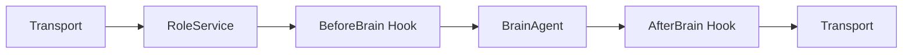

# RoleService

Role 是紫幻中一个基础构件，紫幻的所有能力(IMS Chat, Workspace)都由RoleService来提供。Role Service是紫幻运行的时候，为Role运行提供的能力，负责生命周期管理，还有依赖资源的管理，实际动作执行。

## 属性

- 名称
- 类型
- Brain Agent模型、其它Agent模型
- 特殊的配置prompt
- 工具列表

## 事件与Transport进入

RoleService 不直接面对外部协议，而是通过 Transport 接收事件。Transport 的意义是将"某个渠道发生了什么"翻译为"这个Role现在需要处理什么"，同时屏蔽渠道的通信方式、消息形态和交付细节。

### Role的运行上下文，与类型擦除细节

Role Context表达的是Role在这一次工作中所处的状态。

不同交互环境拥有不同的上下文语义。上下文根据不同Role类型进行类型擦除，将适合Role类型的Role Context传入。

## BefortBrain Agent hook

BeforeBrain Agent hook 是角色进入主推理前的hook

## BrainAgent开始工作

BrainAgent 是 RoleService 的主要Agent(参考[Agent 概念](./agent_concept.md))。它在已准备好的上下文中理解事件，输出内容，或者调用工具/subagent。

## After Brain Agent hook

After Brain Agent hook 是主决策之后、外部行动之前的固定收束阶段。

## 处理结束与Transport输出

当 RoleService 完成一次工作后，结果重新交给 Transport。Transport 将角色已经形成的行动意图呈现为所在渠道能够理解和执行的结果，使Role的内部工作真正抵达用户或工作环境。

