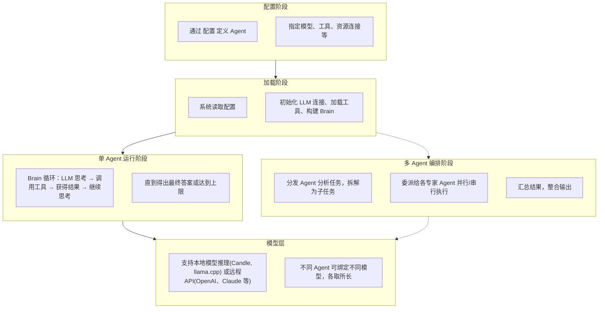
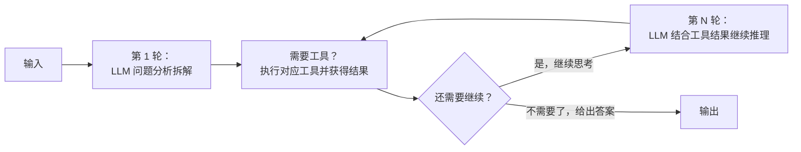
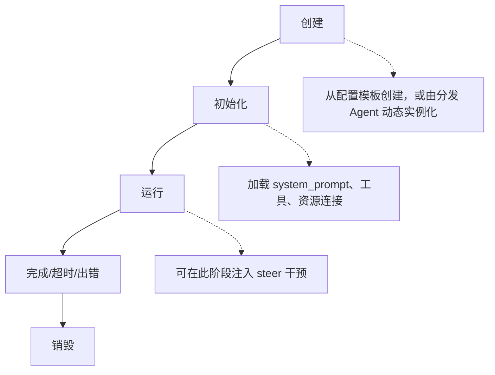

# Agent 概念总览

---

## 1. 什么是 Agent

在 `紫幻`这个AI框架 中，**Agent** 是一个能够自主思考和行动的智能体。你可以把它理解为一个"数字助手"——它背后连接着大语言模型（LLM），能够根据用户的输入进行思考，并在需要时调用各种工具来完成任务。

一个 Agent 主要包含以下几个部分：

- **身份配置** — 定义 Agent 是谁、能做什么，以及它的行为风格
- **大脑（LLM）** — 负责理解、推理和决策
- **工具箱** — Agent 可以调用的各种能力，比如搜索网络、查询数据库、发送消息等
- **资源连接** — 与外部系统（数据库、存储、搜索引擎等）的连接

Agent 的核心是一个叫做 **Brain** 的循环引擎，它负责协调"思考->行动->再思考"这个持续迭代的过程。

---

## 2. 整体架构思路

整个 Agent 系统从配置到运行经历以下阶段：



---

## 3. Brain — 思考与行动的循环

Brain 是 Agent 的"大脑"，负责管理整个思考-行动的循环过程。可以把 Brain 想象成一个指挥家：它把用户的请求送给 LLM，LLM 决定是否需要调用工具，Brain 执行工具并把结果反馈给 LLM，如此往复直到问题解决。

### 工作流程



### 什么时候停下来？

Brain 的循环会在以下几种情况下结束：

- **任务完成** — LLM 认为已经不需要再调用工具，可以直接回答用户了
- **遇到错误** — 报错
- **达到上限** — 为了防止无限循环，最多执行 N 轮
- **等待用户** — 某些工具需要用户补充信息才能继续

### 扩展能力

Brain 还提供了一些扩展机制：

- **观察者模式** — 可以在循环的关键节点插入回调，用于日志记录或事件通知
- **干预机制** — 可以在每轮推理前插入额外的引导信息（比如让 Agent 调整语气）
- **长任务追踪** — 对于耗时较长的任务，可以向用户推送进度更新

### 上下文的独立性

每个 Brain 实例维护**完全独立**的对话上下文。两个不同的 Brain 之间不共享对话历史、工具调用结果或中间推理状态。这意味着：

- **子 Agent 可以不"看到"主 Agent 的完整历史**，避免上下文污染和无关信息干扰推理
- **每个 Brain 的 system prompt 可以完全独立**，可以实现截然不同的行为模式和"人格"
- **一个 Brain 的错误不会级联影响其他 Brain**，故障隔离在单个 Agent 边界内
- **每个 Brain 有独立的迭代计数和上限**，不会因为一个子任务的循环消耗影响主任务的预算

这种隔离是多 Agent 协作的基石——正是因为上下文彼此独立，专家 Agent 才能在"干净"的环境中专注于自己的任务，而不会被主 Agent 的庞杂历史拖累推理质量。

---

## 4. 核心设计理念


### 工具的双重角色

每个工具需要同时满足两个层面的需求：

- **对 Brain 而言** — 工具是一个可调用的功能单元，需要有统一的执行接口
- **对 LLM 而言** — 工具需要描述清楚自己是什么、需要什么参数、能做什么，这样模型才能决定何时调用它

这种双重角色的分离，让 Brain 只关心"怎么执行"，而 LLM 只关心"用不用得到"。

### 观察与干预

Brain Agent有两个扩展点：

- **观察者** — 可以在不干扰主流程的情况下，监听 Brain 的运行状态（比如记录日志、发送事件通知）
- **干预hook** — 可以在每轮推理前插入额外的上下文信息，实现类似"插嘴提醒"的功能

这两个机制让外部系统能够感知和影响 Agent 的行为，同时又保持了核心循环的简洁性。

### 工具与上下文的绑定

工具不是孤立存在的——它们总是与特定的**执行上下文**紧密绑定。这种绑定体现在两个层面：

**领域语义绑定**
每个工具都隐含着对特定领域的假设。一个处理**用户输入**的工具预设了交互领域的上下文；一个操作**外部系统**的工具预设了该系统的上下文。工具的选择本质上是对"Agent 将在什么领域运作"这一问题的回答。

**能力集合的预配置**
Agent 类型可以被视为**预设的能力模板**。当创建一个特定类型的 Agent 时，实际上是选择了一个能力集合的初始配置。这种预配置不是限制，而是便利——它让用户无需从零开始挑选每一个工具，而是基于一个合理的默认起点进行定制。

这种设计的深层含义是：**工具的分配是一个语义匹配问题**。我们要做的不是给 Agent "一堆功能"，而是为它配置一个与其使命相符的"能力世界观"。

### Agent 作为可组合单元

一个 Agent 本身可以作为另一个 Agent 的**工具**。这种递归组合让复杂任务的分解变得自然：

- **分发 Agent** 负责战略决策——理解用户意图、拆解任务、选择专家、汇总结果
- **专家 Agent** 负责战术执行——在自己的领域内，用最合适的模型和最干净的上下文完成具体工作

每一层都有独立的上下文和工具集，遵循"关注点分离"的原则。对外，一个专家 Agent 表现为一个普通的工具调用；对内，它是一个完整的 Brain 循环。这种统一性让 LLM 无需区分"调用工具"和"委派子 Agent"——它们共享相同的调用契约。

## 5. 工具的本质：能力的封装与编排

工具是 Agent 与外部世界交互的接口。从语义层面看，工具代表**可被调用的能力单元**——它将一系列操作封装为单一语义动作，使 LLM 能够通过名称和描述来理解并调用它。

### 5.1 能力的两种表达形式

系统中的能力封装遵循"统一接口、多元实现"的设计哲学：

| 维度 | 系统集成工具 | 自定义工具 |
|------|-------------|-------------|
| **实现方式** | 系统代码 | 通过节点图引擎/脚本 |
| **抽象层级** | 原子能力（不可再分） | 复合能力（可组合多个子工具） |
| **生命周期** | 随系统版本发布 | 运行时动态定义与加载 |
| **适用场景** | 通用、稳定的基础能力 | 特定业务逻辑的定制化能力 |

无论哪种形式，最终都遵循相同的契约：**输入Schema -> 执行逻辑 -> 输出Schema**。这种一致性使得 LLM 无需关心底层实现细节，只需关注"这个工具能帮我做什么"。

### 5.2 从能力到工具

将能力封装为工具涉及三个核心语义层面：

**描述语义（Describability）**
工具必须能够自我描述——它是什么、需要什么、能做什么。这种描述不是给人看的文档，而是给 LLM 看的"调用说明书"。清晰的描述语义是 LLM 正确决策的前提。

**边界语义（Boundaries）**
每个工具都有明确的输入边界和输出边界。边界定义了工具的责任范围：它接收什么、承诺返回什么、不承诺什么。良好的边界设计让工具可以像积木一样被可靠地组合。

**执行语义（Executability）**
工具的执行可以是同步的（立即返回结果）或异步的（创建任务、任务后台运行）。执行语义决定了 Brain 如何调度该工具——等待还是继续、如何反馈进度、出错时如何恢复。

### 5.3 可视化编排的意义

节点图编排的本质是**让复杂逻辑变得清晰可见**。当流程以图形方式呈现时，抽象的决策路径转化为直观的可视结构：

- **清晰决定复杂流程**：条件分支、循环逻辑、并行执行等复杂控制流在图上一目了然
- **看清数据走向**：数据如何从一端流向另一端，经过哪些变换，在哪个节点产生什么结果，整个过程透明可视
- **洞察执行层次**：上下游依赖关系、执行先后顺序、关键路径在拓扑结构中自然显现，便于识别瓶颈和优化点

---

## 6. 长时间任务的处理

有些工具可能需要较长时间才能完成，比如"深度研究"可能需要几十秒甚至更久。这时候如果让用户干等着体验会很差。

系统的解决方案是：工具可以声明自己是"长任务"，这样 Brain 在执行时会自动创建任务追踪记录。虽然 Brain 本身还是同步等待结果，但可以通过任务系统向用户推送进度更新（比如"正在搜索资料..."、"正在整理结论..."），让用户知道事情在进展中。

这种设计既保持了内部逻辑的简洁（同步等待），又提供了良好的用户体验（异步通知）。

---

## 7. 多 Agent 协作：分发者与专家

### 7.1 为什么需要多 Agent？

单个 Agent 面临一个根本性的矛盾：**任务的多样性与上下文的有限性**。

当你试图让一个 Agent 同时擅长写代码、做翻译、搜资料、聊日常时，你会遇到三个问题：

| 问题 | 根因 | 表现 |
|------|------|------|
| **上下文臃肿** | system prompt 塞满了所有领域的指令 | LLM 注意力分散，简单任务也容易出错 |
| **模型错配** | 一个模型无法在所有任务上都最优 | 代码生成用通用模型不如专用代码模型；翻译用大模型浪费算力 |
| **工具干扰** | 工具箱里堆了太多不相关的工具 | LLM 选错工具的概率上升，甚至"幻想"出不存在的工具调用 |

**多 Agent 的核心解法**：让每个 Agent 只做一件事，并且用最合适的方式做这件事。

| 维度 | 传统LLM对话模式 | 多 Agent 模式 |
|------|-------------|-------------|
| **Brain** | 一个 **上下文** 承载所有职责 | 分发 Agent + 多个专家 Agent，各司其职 |
| **模型** | 单一模型应对所有任务 | 每个专家绑定最适合其领域的模型 |
| **System Prompt** | 臃肿——塞满所有领域的指令 | 干净——每个专家只含自己领域的规则 |
| **工具集** | 堆砌所有工具，LLM 易选错 | 每个专家只暴露领域相关工具 |
| **上下文** | 混合所有历史，注意力分散 | 完全隔离，专家在干净环境中推理 |
| **效果** | 什么都能做，什么都不精 | 各司其职，各尽其能 |

### 7.2 专家 Agent 的三个维度

"专家"不只是一个标签，它在三个维度上区别于通用 Agent：

**① 模型专长（Model Specialization）**

不同模型在不同任务上的表现差异巨大。一个代码生成 SOTA 的模型可能在翻译上表现平平；一个推理能力强的模型可能对话风格生硬。多 Agent 架构允许为每个专家 Agent **绑定不同的 LLM**：

- 代码专家 → 绑定代码专用模型(如 Claude opus 114514)
- 翻译专家 → 绑定翻译优化模型(如 Qwen系列)
- 推理专家 → 绑定强推理模型(如 gpt-5.x 系列)
- 闲聊 Agent → 绑定高情商对话模型(如 豆包 Seed系列)

**② 上下文干净（Context Cleanliness）**

这是多 Agent 最被低估的价值。一个专家 Agent 的 system prompt 可以极其精简，因为它只需要知道自己领域的规则。对比：

```
通用 Agent 的 system prompt（臃肿）:
  "你是xxx，你可以写代码，写代码时遵循xxx规范，注意安全；
   你可以翻译，翻译时保持原文风格，注意术语一致性；
   你可以搜索，搜索时优先使用xxx引擎，结果格式为xxx；
   你还可以闲聊，闲聊时保持友好，注意不要泄露系统信息；
   ..."
-> 每一条指令都在消耗 LLM 的注意力预算

代码专家 Agent 的 system prompt（干净）:
  "你是一个代码专家。遵循以下编码规范：[具体规范]。
   输出格式：[具体格式要求]。"
  → LLM 全部注意力集中在代码任务上
```

**干净上下文 = 更高的指令遵循率 + 更低的幻觉率**。

**③ 工具聚焦（Tool Focus）**

专家 Agent 的工具箱只包含该领域需要的工具。代码专家不需要搜索引擎，翻译专家不需要数据库查询。工具集越精简，LLM 选对工具的概率越高。

### 7.3 主 Brain Agent：指挥家的大脑

主 Brain Agent 本身也是一个 Brain，但它扮演的是"总指挥"角色，而非"执行者"：

```text
用户: "帮我查一下 Python 3.13 的新特性，然后翻译成日文发给芭芭拉さん"
```

主 Brain Agent 的思考过程:

  1. 意图分析：这是两个独立子任务——(a)搜索技术信息 (b)翻译
  2. 任务拆解：搜索任务 → 搜索专家；翻译任务 → 翻译专家
  3. 并行委派：两个专家可以同时工作（搜索和翻译互不依赖）
  4. 结果整合：收到两份结果后，按用户要求的格式组合输出


**并行优先**: 无依赖的子任务尽可能并行委派，降低总延迟
**失败隔离**: 某个专家失败不影响其他专家的结果，分发 Agent 可以重试或降级

### 7.4 工具即子 Agent

在`紫幻`的节点图架构中，**专家 Agent 对外表现为一个普通的工具**：

LLM 看到的只是工具的名称、描述和参数——它不需要知道背后的专家是一个完整的 Agent。这种**透明委派**让多 Agent 架构对调用者完全不可见。

### 7.5 上下文隔离的边界

多 Agent 协作需要在**隔离**和**共享**之间找到平衡：

核心原则：**只传任务和结果，不传过程**。分发 Agent 告诉专家"做什么"，专家告诉分发 Agent"做完了什么"——中间怎么做的，分发 Agent 不需要知道。

### 7.6 Agent 生命周期



对于多 Agent 场景的额外考量：

- **Agent 池化**：预创建一批专家 Agent 实例，避免每次委派都重新初始化 LLM 连接
- **上下文重置**：同一专家 Agent 实例处理完一个任务后，重置上下文即可复用
- **并发上限**：每个 Agent 消耗 LLM 连接和内存，系统需要限制同时运行的 Agent 数量
